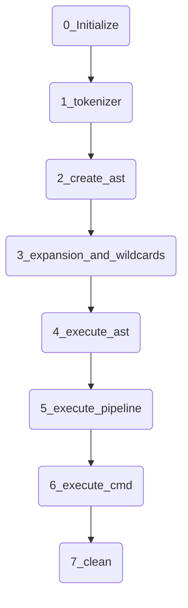

# Minishell 42
*This project has been created as part of the 42 curriculum by Thbouver and Glucken*
## Description

### Architecture

<details>
<summary> Intialisation</summary>
init_minishell()
copy envp
setup_signal???
read one line with read_line()
process the line with process_command()
<details>
<summary>1_tokenizer</summary>
All the command line is split into tokens separate by space and operators (&&, ||, |) and parenthesis.
here we check if the parenthesis, quotes or double quotes are well closed.
<summary>2_create_ast</summary>
the ast is created respecting the priorities, such as | is prioritise on || and &&. a node is wether an opreator or a link list of strings.
<summary>3_expansion and  wildcards</summary>
We detect all variables with the $ and expand them to the value knonw in the environnement.


</details>

````

## Instruction

## Resources
