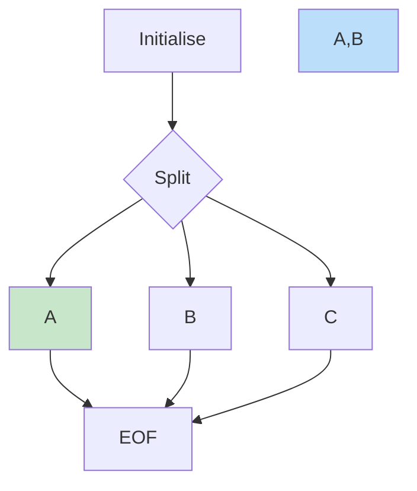

# Minishell 42
*This project has been created as part of the 42 curriculum by Thbouver and Glucken*
## Description

### Architecture

<details>
<summary> Intialisation</summary>
init_minishell()
copy envp
setup_signal???
read one line with read_line()
process the line with process_command()
<details>
<summary>Read and go to process</summary>


</details>

````

## Instruction

## Resources
