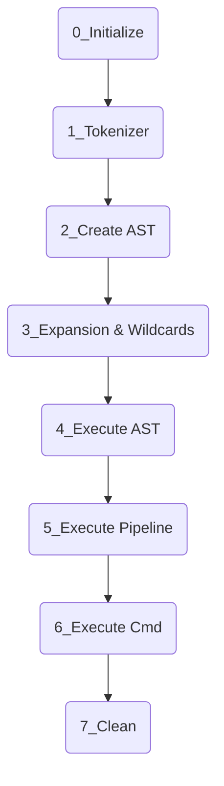

# Minishell 42
*A project created as part of the 42 curriculum by Thbouver and Glucken*

> ### *"If a thing is worth doing, it is worth doing badly."*
> ### — G. K. Chesterton

## Description

0 — Initialisation

- `init_minishell()`: copy envp, setup signals
- Read a line with `readline()`
- Process the line with `process_input()`

1 — Tokenizer

The command line is split into tokens separated by spaces and operators (`&&`, `||`, `|`) and parentheses.
We also check that parentheses, quotes and double quotes are properly closed.

2 — Create AST

The AST is built respecting operator priorities (`|` has higher priority than `||` and `&&`).
A node is either an operator or a linked list of strings.

3 — Expansion & Wildcards

We detect all variables prefixed with `$` and expand them to their value from the environment. `$?` expands to the last exit status.
We detect all `*` patterns and match them against existing files.

4 — Execute AST

We traverse the AST recursively, starting from the bottom-left. Each node is executed (or not) depending on the status of the previous one.
For each node, if it's a simple command, we check if it's a built-in; otherwise we fork and execute the binary.
If we encounter a pipeline node, we call the pipeline execution.

5 — Execute Pipeline

When we encounter a pipe, we start a pipeline. With parentheses, a command inside the pipeline can be another AST, so `exec_ast` is called again.
Otherwise the command is executed inside the forks inherent to the pipeline.

6 — Execute Cmd

All mandatory built-ins are handled here. When there are redirections, we carefully swap stdin/stdout for the command.

7 — Clean

Thanks to the central `t_minishell` struct, after each command we clean up values from the previous one. On exit, the entire structure is freed.

## Usage

Minishell must be launched without arguments. It handles everything required by the subject, including bonuses.
An invalid command will return properly without crashing or leaking memory (except for leaks caused by `readline` itself).

## Resources

- **"Classic Shell Scripting"** — reading the introduction and chapter 7 was very helpful to get started in the right direction.
- **YouTube channels** like Oceano.
- Medium articles were vague and not very useful.
- The biggest help came from **other 42 students**, whether slightly or way more advanced, their advice was invaluable.
- AI was used to understand new concepts, get advice, search the internet, and for desperate debugging sessions.
