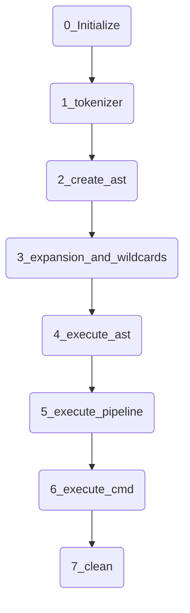

# Minishell 42
*This project has been created as part of the 42 curriculum by Thbouver and Glucken*
## Description

### Architecture

<details>
<summary> Intialisation</summary>
init_minishell()
copy envp
setup_signal???
read one line with read_line()
process the line with process_command()
<details>
<summary>1_tokenizer</summary>
All the command line is split into tokens separate by space and operators (&&, ||, |) and parenthesis.
here we check if the parenthesis, quotes or double quotes are well closed.
<summary>2_create_ast</summary>
the ast is created respecting the priorities, such as | is prioritise on || and &&. a node is wether an opreator or a link list of strings.
<summary>3_expansion and  wildcards</summary>
We detect all variables with the $ and expand them to the value knonw in the environnement. $? is expand as the error status.
We detect all * and find all files matching the pattern.
<summary>4_execute_ast</summary>
We going through the ast recursively, it will begin from left bottom and execute por not the next node depending on the status of the other one. For each node, if it's a simple command it will separate into buitls ins commands or not and fork for a executable commande.
Is we encounter a pipeline we will call the execution of a pipeline.
<summary>5_execute pipeline</summary>
when we encounter a pipe we begin a pipeline, with parenthesis a commande inside a piepeline can be another ast, and exec_ast we will be called. If not the commande is executed inside the forks inhrentlz to the pipeline.
<summary>6_execute_cmd</summary>
Here we have all the built-ins mandatory. When we have redirections we have to carrefully change the stdin and out for the command.
<summary>7_clean</summary>
Thank's to the big minishell struct, when we go to new command, we have to clean all value from the last command. When we exit minishell have to clean all the minishell structure.


</details>

````

## Instruction

minishelle has to be execute without arguments. It manage only what ask in the subject with bonuses. A forbidden command should return the command line properly without crahsing or memory leak, execpt for the ones caused by the readline.


## Resources
One of the biggest help com from "Classic Shell Scripting", a lecture of the introduction and the chapter 7 is very helpful to go to the good direction.
Some good youtube chanel like Oceano.
Mediums article ar vague and not very helpful.
The biggest help came form other advices of other students,  little bit or really more advandec, it has been really helpful.
IA has been used to grasp new concept, advices, internet searching and desesparate case.
 
